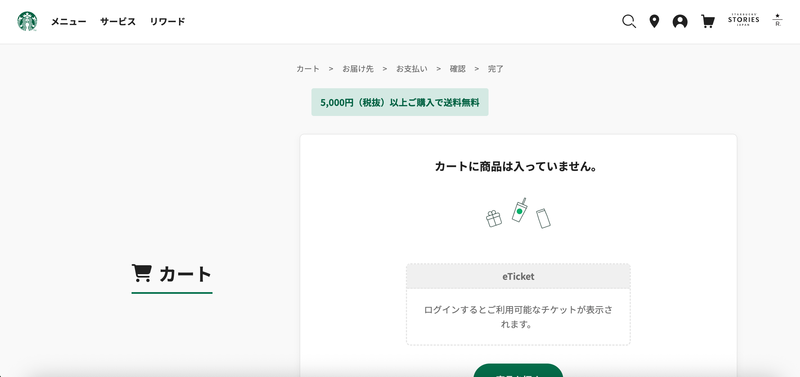

# [スターバックスのECサイト] 模写

スターバックスのECサイトを参考にして作成した模写サイトです。  
HTML、CSS、JavaScriptの学習を目的として制作しました。

## 完成画像

<!-- スクリーンショットを追加 -->


## 制作目的

- HTML/CSSの基礎知識の定着
- レスポンシブデザインの実装練習
- JavaScriptを使った動的な要素の実装
- Gitを使った開発フローの習得

## 使用技術

- **HTML5**
- **CSS3**
- **JavaScript**
- **Git/GitHub**

## 実装した機能

- [x] レスポンシブデザイン（スマホ・タブレット対応）
- [x] ハンバーガーメニュー
- [x] スムーススクロール
- [x] ホバーエフェクト

## 対応ブラウザ

- Chrome（推奨）
- Firefox
- Safari
- Edge

## ローカルでの実行方法

1. リポジトリをクローンまたはダウンロード
```bash
git clone https://github.com/Yuri-Inaishi/WebSiteCopy.git
```

2. フォルダを開く
```bash
cd repository-name
```

3. `index.html` をブラウザで開く

## ファイル構成

```
project-root/
├── index.html          # メインページ
├── css/
│   └── style.css      # スタイルシート
├── js/
│   └── script.js      # JavaScript
├── images/            # 画像ファイル
└── README.md          # このファイル
```

## 工夫したポイント

- **コーディング**: 参考サイトのコードを見ずに、見た目から読み取って一からコーディング
- **レスポンシブデザイン**: モバイルファーストで設計し、各デバイスで見やすいレイアウトを実現
- **アニメーション**: CSS transitionを使用してスムーズな動きを実装
- **アクセシビリティ**: 適切なHTMLセマンティクスとalt属性を使用

## 学んだこと

- Flexboxを使ったレイアウト設計
- メディアクエリによるレスポンシブ対応
- JavaScriptでのDOM操作
- Git/GitHubを使ったバージョン管理

## 今後の改善予定

- [ ] パフォーマンスの最適化
- [ ] より細かいアニメーション効果の追加
- [ ] お問い合わせフォームの実装
- [ ] SEO対策の実施

## お問い合わせ

何かご質問がございましたら、お気軽にお声かけください。

- GitHub: [@Yuri-Inaishi](https://github.com/Yuri-Inaishi)
- Email: yuri.0228ex@gmail.com
- Portfolio: https://github.com/Yuri-Inaishi/WebSiteCopy.git
